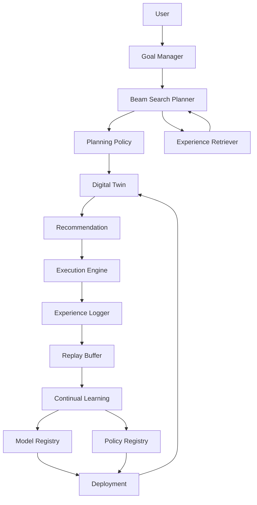

# AURA Architecture V2

## Complete Adaptive Planning Loop

## Responsibilities

- Goal Manager: represents target skills and desired outcomes.
- Beam Search Planner: explores candidate action sequences.
- Planning Policy: ranks actions using empirical execution evidence.
- Experience Retriever: finds similar successful and unsuccessful episodes using state, goal, and action similarity.
- Digital Twin: simulates predicted state transitions.
- Recommendation: explains and selects a plan.
- Execution Engine: tracks real action completion and failure.
- Experience Logger: persists actual outcomes for learning.
- Replay Buffer: filters, prioritizes, and samples experiences.
- Continual Learning: builds datasets, trains candidates, benchmarks, and gates updates.
- Model Registry: records transition-model lineage and deployment status.
- Policy Registry: records policy lineage, benchmark history, and rollback state.
- Deployment: promotes accepted models and policies and restores prior versions on failure.

## Research Properties

The V2 architecture makes planning behavior measurable through policy entropy, planner confidence, coverage, drift, retrieval metrics, benchmark metrics, and versioned experiment records.

Sprint 11.2 adds retrieval-augmented planning: policy evidence and episodic matches are fused before beam ranking. Retrieval supports configurable metrics, caching, diversity-aware Top-K selection, benchmark evaluation, and registry provenance.
